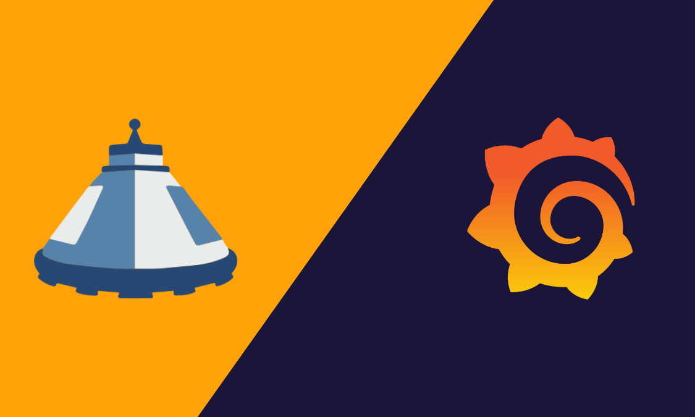

# Capsule ❤️ Observability

## Overview

This repository holds different controllers and addons which help you to manage multi-tenancy in your Kubernetes cluster in combination with the [LGTM-Stack](https://grafana.com/go/webinar/getting-started-with-grafana-lgtm-stack/)

## Documentation

See the following topics for more information on how to use this addon:

- [Proxies](docs/proxy/README.md)
- [Development](docs/development.md)

If you notice any issues, please report them in the [GitHub issues](https://github.com/peak-scale/observability-tenancy/issues/new). We are happy for any contribution.

## Support

This addon is developed by the community. For enterprise support (production ready setup,tailor-made features) reach out to [Capsule Supporters](https://projectcapsule.dev/support/)
